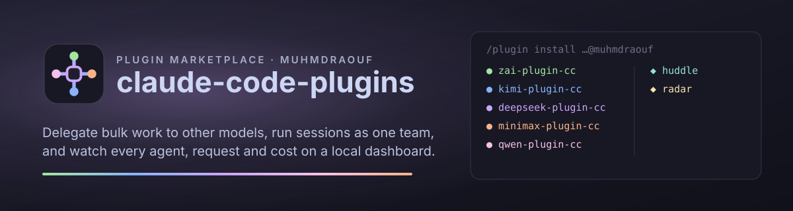

<p align="center">
  
</p>

[](https://github.com/MuhmdRaouf/claude-code-plugins/actions/workflows/ci.yml)
[](LICENSE)
[](https://code.claude.com/docs/en/plugins)
[](https://bun.sh/)
[](https://nodejs.org/)

<p align="center">
  <a href="https://github.com/sponsors/MuhmdRaouf"></a>&nbsp;&nbsp;<a href="https://buymeacoffee.com/muhmdraouf"></a>
</p>

- `muhmdraouf` is a [Claude Code](https://code.claude.com) plugin marketplace.
- Hand bulk work to other models. Claude keeps the planning and the review.
- Let several Claude sessions work as one team, and see what every agent does and spends on a local dashboard.
- Install a plugin, run its setup command, and it works.

## Plugins

| Plugin | What it does | Setup |
|---|---|---|
| [zai-plugin-cc](plugins/zai-plugin-cc) | GLM (Z.ai) as two Claude Code agents: `zai:glm-5.3` for implementation and bulk edits, `zai:glm-5.3-flash` for read-only sweeps. | `/zai:setup` |
| [kimi-plugin-cc](plugins/kimi-plugin-cc) | Kimi (Moonshot AI): `kimi:kimi-k3` and `kimi:kimi-k2.6`. | `/kimi:setup` |
| [deepseek-plugin-cc](plugins/deepseek-plugin-cc) | DeepSeek: `deepseek:deepseek-v4-pro` and `deepseek:deepseek-flash`. | `/deepseek:setup` |
| [minimax-plugin-cc](plugins/minimax-plugin-cc) | MiniMax: `minimax:MiniMax-M3` and `minimax:MiniMax-M2.7-highspeed`. | `/minimax:setup` |
| [qwen-plugin-cc](plugins/qwen-plugin-cc) | Qwen (Alibaba Cloud): `qwen:qwen3.8-max` and `qwen:qwen3.8-flash`. | `/qwen:setup` |
| [huddle](plugins/huddle) | Channels where Claude sessions, their subagents and other agents work as one team: messages, tasks that wait on each other, pause and resume, shared knowledge, approval rules, conflict warnings and a live dashboard. | `/huddle:setup` |
| [observatory](plugins/observatory) | A zero-token dashboard of every session, agent, request, tool call and estimated cost, with budgets, alerts, desktop notifications and a `/metrics` endpoint. | none: `/observatory:start` |

Every provider plugin also has:

- `/<p>:board`: what runs now;
- `/<p>:usage`: tokens, estimated cost, router health;
- `/<p>:review` and `/<p>:remove`;
- `/<p>:setup:omp`, `/<p>:setup:opencode` and `/<p>:setup:pi`: hand jobs to
  [omp](https://github.com/can1357/oh-my-pi), [opencode](https://opencode.ai) or
  [pi](https://github.com/badlogic/pi-mono). Those tools run as you set them up.

[plugins.md](plugins.md) covers every plugin in depth.

## Install

1. In Claude Code, add the marketplace and install a plugin:

   ```
   /plugin marketplace add MuhmdRaouf/claude-code-plugins
   /plugin install zai-plugin-cc@muhmdraouf
   ```

2. Restart Claude Code.
3. Run the plugin's setup command from the table.

- Provider plugins ask for your own API key and keep it in the OS keychain. Nothing else needs configuring.
- From a terminal: `claude plugin marketplace add MuhmdRaouf/claude-code-plugins`, then
  `claude plugin install <plugin>@muhmdraouf`. `--scope project` enables it for one repository.
- Update: `/plugin marketplace update muhmdraouf`.
- Remove a provider plugin: run `/<p>:remove` first, then `/plugin uninstall <plugin>@muhmdraouf`.
- Runtime: Bun 1.3 or later by default, Node 22.3 or later otherwise (huddle: Node 22.5 or later).

## Layout

```
.claude-plugin/marketplace.json   the catalogue: one entry per plugin
plugins/<project>/                a plugin's project: source, tests, build scripts, README
plugins/<project>/plugin/         what Claude Code installs: manifest, agents, commands, skills, hooks, bundled dist/
packages/core/                    the engine every provider plugin bundles (ARCHITECTURE.md describes it)
scripts/check-siblings.mjs        fails when the five provider plugins drift apart
scripts/check-attribution.mjs     fails when any commit credits an AI tool
.claude/settings.json             turns off Claude Code's commit and PR attribution here
assets/                           the logo and banner
plugins.md                        every plugin in depth: layout, architecture, usage, failure modes
```

- The root `package.json` is an npm workspace over `packages/*` and the npm plugin projects, with one
  `package-lock.json`.
- `plugins/huddle` is a Bun project with its own `bun.lock`.

## Development

```sh
npm ci
npm run check                            # the sibling check, then every workspace's checks
npm run check -w plugins/zai-plugin-cc   # one plugin
claude --plugin-dir ./plugins/zai-plugin-cc/plugin
(cd plugins/huddle && bun install && bun test && bin/rehearse)
```

- Plugins that ship a bundle commit it, so installs need no build step. `npm run build -w plugins/zai-plugin-cc`
  rebuilds it.
- The five provider plugins are siblings over one core. `npm run check:siblings` compares each with zai after
  replacing the provider's names.
- [AGENTS.md](AGENTS.md) has the rules for commits and coding agents.

CI:

- Runs a workspace's checks when its files change: core, each provider plugin, observatory and huddle (Bun, and
  Node 22.5 and 24).
- Adds Node 22, macOS (including a real Keychain round trip) and next-Ubuntu legs.
- Every push also runs the sibling check, marketplace validation, gitleaks and the attribution check.
- Branch protection requires `ci-ok`.

## Support

<p align="center">
  If these plugins make your day a little easier, you can say thanks here:
</p>

<p align="center">
  <a href="https://github.com/sponsors/MuhmdRaouf"></a>&nbsp;&nbsp;<a href="https://buymeacoffee.com/muhmdraouf"></a>
</p>

- Bugs and ideas: [open an issue](https://github.com/MuhmdRaouf/claude-code-plugins/issues).

## Trademarks

- This is an independent project. It is not affiliated with, endorsed by or sponsored by Anthropic or any model
  provider.
- Claude and Claude Code are trademarks of Anthropic, PBC.
- GLM and Z.ai, Kimi and Moonshot AI, DeepSeek, MiniMax, Qwen and Alibaba Cloud, omp, opencode and pi belong to their
  respective owners. They are named only to say what the plugins work with.
- The provider plugins call each provider's public API with your own key. Your use is subject to that provider's
  terms and pricing.

## License

[GPL-3.0-or-later](LICENSE). Copyright © 2026 [Raouf](https://github.com/MuhmdRaouf).
