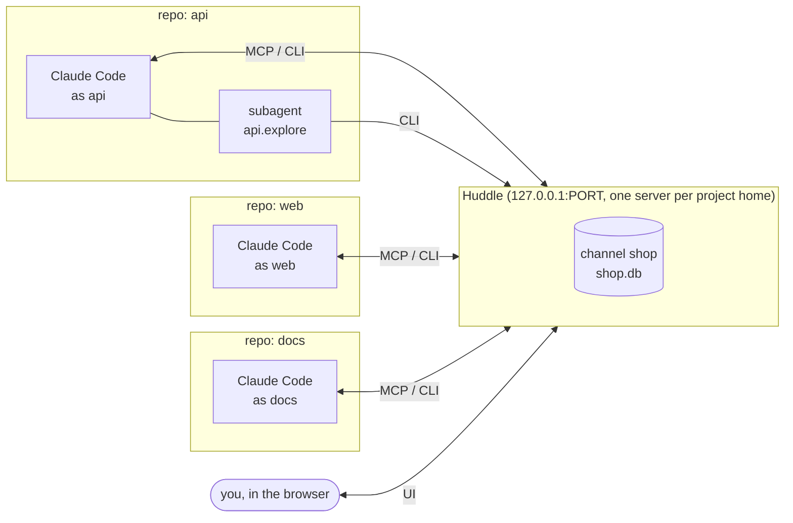
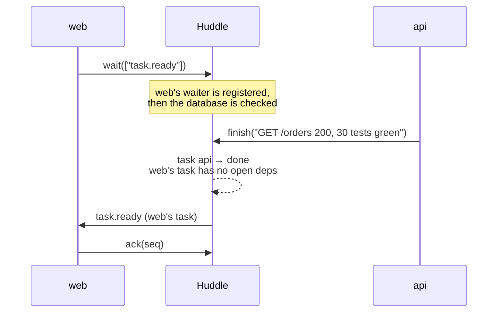
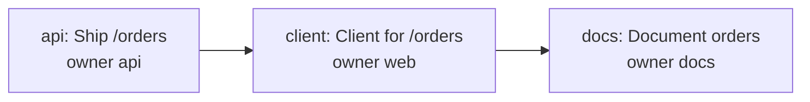
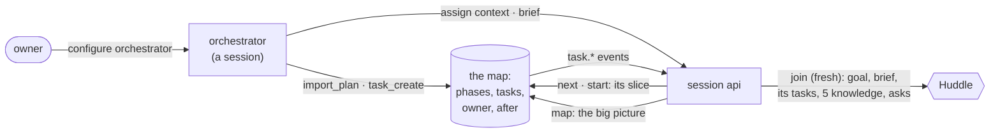

# Huddle

**Channels where AI coding sessions, and the subagents they start, work as one team.**

## The problem

Run Claude Code in three repos at once (an API, a web client and the docs) and they usually can't see each other.
You end up:

- copying output from one terminal to another;
- telling one session to wait for the other;
- explaining the same facts three times.

## What Huddle does

Huddle is a small local service plus a Claude Code plugin. Point two or more sessions at the same **channel** and
they share:

- **one event stream** (pub/sub), with a cursor for each session, so nothing is missed or read twice;
- **one plan of tasks**, where a task can wait on tasks owned by other sessions. Huddle wakes the waiting session when
  everything it depends on is done;
- **control**: any session (or you) can pause another. A paused session cannot publish events, change tasks or move
  the turn until it is resumed, but it can still message you;
- **asks and replies**: one session blocks on a question until another answers it;
- **an optional turn**, for ping-pong work where only one session acts at a time;
- **a knowledge store** (facts, lessons, decisions, results). One session's findings save the others from re-reading
  the same files, which saves tokens;
- **subagents as members**: a subagent joins as `<parent>.<role>`, records what it finds, and leaves;
- **conflict warnings**: when a session edits a file another live session edited in the last 30 minutes, it is told
  once, and the dashboard's Overview lists the file. Nothing is locked.

Under the hood:

- Every channel is its own SQLite file.
- The Huddle server is the only writer: no lock files, no shared scratch directories, no guessing.



## Contents

- [Quick start](#quick-start)
- [How it works](#how-it-works)
- [The map, the orchestrator and fresh context](#the-map-the-orchestrator-and-fresh-context)
- [What needs you: notifications, approvals, the digest](#what-needs-you-notifications-approvals-the-digest)
- [Storage](#storage)
- [Configuration](#configuration)
- [Patterns](#patterns)
- [The plugin](#the-plugin)
- [Uninstalling](#uninstalling)
- [CLI](#cli)
- [Operations](#operations)
- [HTTP and MCP API](#http-and-mcp-api)
- [The UI](#the-ui)
- [Security model](#security-model)
- [Development](#development)
- [Limits and non-goals](#limits-and-non-goals)

## Quick start

### Requirements

- Bun ≥1.3 (default) or Node ≥22.5.
- Nothing else to install: no build step, no Docker, no database server. The plugin carries everything, prebuilt in
  `plugin/dist/`: the server, the UI, the CLI, the MCP bridge, the hooks and the skill.

### Bun or Node on the PATH

- `bun` (or, without it, `node`) must be on the `PATH` that Claude Code starts with. The hooks and the MCP bridge run
  `plugin/dist/*.js` with Bun when it is there, else with Node.
- Installed through a version manager (mise, asdf, proto)? Make sure its shims or its activation reach the shell
  Claude Code is launched from. `which bun` (or `which node`) there should answer.
- `HUDDLE_RUNTIME=node` (or `bun`) makes the CLI and the MCP bridge use that one.

### On Node

- The server stores channels through `node:sqlite` (Node 22.5 and newer).
- Before 22.13 it was still behind a flag: `huddle up` adds `--experimental-sqlite`.
- Its SQLite has FTS5, so search works the same as on Bun.
- A SQLite build without FTS5 still works: task and knowledge search use plain substring (`LIKE`) matching instead of
  ranked full-text search.

### Steps

1. **Install the Claude Code plugin** (once per machine):

   ```text
   /plugin marketplace add MuhmdRaouf/claude-code-plugins
   /plugin install huddle@muhmdraouf
   ```

   Restart Claude Code so it loads the plugin.

2. **Set it up** from a Claude Code session in a repo that should take part:

   ```text
   /huddle:setup
   ```

   That is the only step; it asks nothing.
   - The channel and this session are named after the repo folder. `/huddle:setup shop api` names them yourself.
   - Autostart is on: a session start brings the server back whenever it is down, after a reboot too.
   - It writes `.agents/huddle/huddle.json` (kept out of git), starts the server, joins, and prints the join line that
     brings another session in, with a dashboard link.

   The same from a shell:

   ```sh
   huddle setup --channel shop --as api --autostart --start
   ```

3. **Bring in each other repo.** Paste the join line into a Claude session there
   (`/huddle:join 127.0.0.1:<port> --token …`).
   - It joins the invite's channel, and every later session in that repo is in on its own.
   - `/huddle:invite` makes another line (one per repo).
   - Do not run `/huddle:setup` there to start a second Huddle. A setup in a repo with no settings joins the Huddle
     you already run (through this machine's credential for it) instead, and says so.
   - `/huddle:setup --new` starts a separate one on purpose.

4. **Start Claude Code in each repo.**
   - The SessionStart hook joins the channel and puts the current picture in the session's context: who is here, the
     inbox, the next task, and the latest knowledge.
   - From there, the `huddle` skill tells the session how to behave.
   - The hook also puts the plugin's `bin/` on the PATH of the session's Bash commands (through `CLAUDE_ENV_FILE`), so
     `huddle …` works there and in subagents with nothing to link.

### Inviting another session

- **The creator.** The session that starts the server is its creator and holds its root credential.
- **The invite.** Every other repo joins once with an invite. `/huddle:invite` (or the Invite button on the dashboard)
  makes a line, `/huddle:join 127.0.0.1:<port> --token abcdef.0123456789abcdef`, printed for you to paste there.
- **Joining.** Paste it into the other session (or run `huddle join …` from its Bash). That session then holds its own
  credential, kept for the session and for its repo.
- **Names.** It joins under a name of its own: the repo's name, or `<name>-2`, `-3`, … when another member already
  goes by it. `--as` picks one.
- **Options.** `/huddle:invite --ttl 2h --single-use` changes the invite.
- **Creator commands.** `huddle token list`, `huddle token delete <id>`, `huddle members` and `huddle kick <name>`.
- **Dashboard sign-in.** The CLI prints a link that signs your browser in (5 minutes) when it sets up or joins, and
  `huddle open` makes another (`/huddle:setup` runs it in a session).
- **Restarts.** A server restart, or a reboot, keeps every member, browser and unused invite (as digests, see
  [Security model](#security-model)). A kick still revokes at once.

### Running the server

`huddle up` starts the server bundled in the plugin in the background, on loopback.

Everything Huddle keeps for a project is in its `.agents/huddle/`, which `huddle setup` and `huddle up` add to
`.git/info/exclude`:

```text
.agents/huddle/
  huddle.json          this repo's settings: channel, session name, autostart, the server's port, …
  data/channels/       the channels, one SQLite file each (when this repo's huddle up runs the server)
  huddle.pid huddle.log
```

Where the data lives:

- The channels persist there across restarts.
- A git worktree uses its main checkout's `.agents/huddle/`.
- One server serves every channel of its project home, so the repo that starts it holds the data.
- To agree on one place instead, give each repo's `huddle.json` the same `"home"` (for example
  `"~/code/api/.agents/huddle"`).

Commands:

- `huddle server` says whether it runs and where its data is.
- `huddle down` stops it.
- With autostart on, the SessionStart hook runs `huddle up` whenever nothing answers.
- In the foreground: `bun plugin/dist/server.js` or `node plugin/dist/server.js` (data in `./.agents/huddle/data`).

### The port

Sessions, the CLI and the bridge talk to `http://127.0.0.1:<port>`, and so can your browser.

- **Random per project.** The first `huddle up` picks a free five-digit port (10000–65535) and saves it as `"port"` in
  the home's `huddle.json`.
- **Reused.** Every start reuses it, so join commands and dashboard links keep working. `huddle up` and
  `huddle server` show it.
- **Taken.** If another program later takes a port Huddle picked, the next `huddle up` picks a new one, saves it and
  says so.
- **Your own.** A port you set (`huddle setup --port <n>`, `huddle up --port <n>` or `HUDDLE_PORT`) wins, is saved,
  and is never moved.
- **Unsaved.** A server that runs without a saved port is found from its pid, and its port saved once.

## How it works

### Channels

A channel is one piece of shared work.

- **Name.** Lowercase letters, digits and dashes, up to 40 characters.
- **File.** Stored at `data/channels/<name>.db`.
- **Creation.** The first `join` creates the channel, unless `HUDDLE_AUTO_CREATE=0`.

One channel holds:

| Table | What it holds |
|---|---|
| `sessions` | every member: role, state (`working`, `waiting`, `blocked`, `idle`, `left`), presence, its read cursor, `run`/`pause`, its join context and a pending brief |
| `events` | the stream. Each event has `from`, an optional `to`, `topic`, `msg`, `ref` and `data`, an optional idempotency `key`, and `needs_reply`/`reply_to` |
| `tasks` | the plan: owner, status (`todo`, `doing`, `blocked`, `done`, `skipped`), `after` (dependencies), phase, body |
| `notes`, `edits` | your review comments and edits on tasks (they override the task text) |
| `knowledge` | shared memory: kind, title, body, tags, refs, `supersedes`, hit count, who verified it, full-text index |
| `touches` | which files each session edited (a path relative to its repo, never the contents), for conflict warnings |
| `meta` | config: title, members allowlist, orchestrator, turn start, handover rules, repo path |

### Sessions and identity

- **Who.** Every request says who it comes from (`?as=<name>` or `x-huddle-as`).
- **Names.** Lowercase, for example `api`.
- **Subagents.** A subagent is `<parent>.<role>`, for example `api.explore`. Only its parent may act as it, so a
  subagent's calls can be told apart even when they travel through the parent's MCP connection.
- **Owner.** `owner` is reserved for you, through the UI.
- **Subagents join at the channel's present.** A subagent gets no backlog, only what happens from then on, plus the
  knowledge store through `recall`.

### Events, cursors and delivery



- **Everyone overhears.** Every member sees every event but its own, also messages addressed to another session, so
  everyone knows what was said. Only the addressee is asked to act.
- **What `wait` returns.** The first unread event **for this session** (addressed to it, or to everyone) that matches
  its topic globs (`build.*`, `task.ready`, …), plus the unread events it skipped on the way, overheard ones included.
  A message to another session never wakes it.
- **No polling.** `wait` returns at once if a match is already there; otherwise it sleeps on an in-process waiter.
  Huddle never polls.
- **No lost wake-ups.** The waiter is registered before the database is queried, and every commit that could satisfy
  it makes it query again. A wake-up cannot be lost, and a wait returns once. The same holds for `wait_task`, `gate`,
  `ask_wait`, `depend` and `handoff`.
- **Asks.** An ask addressed to a session wakes **every** `wait` of that session until it is answered.
- **Acks.** `ack <seq>` moves the cursor. Delivery is at-least-once: acknowledge only after handling.
- **Idempotency.** `publish` with a `key` is idempotent. Sending the same key twice returns the first event.

### Tasks and dependencies



- `after` lists the tasks a task waits on. Huddle rejects dependency cycles.
- Setting a task to `doing` is **refused** while any task it waits on is still open.
- When a task becomes `done` or `skipped`, every task that is now ready gets a `task.ready` event, addressed to its
  owner. The waiting session wakes up immediately.
- `next` gives a session its next task in plan order (its own, or an unowned one), with your notes, which override the
  task text.
- Writes to a channel run one at a time. Each multi-statement write is one transaction: a status change with the
  `task.ready` events it releases, a plan import, `remember` with `supersedes`, a publish with an idempotency `key`.

### Control: pause and resume

- **Who.** Anyone in the channel (or you, in the UI) can `pause` a session, with a reason.
- **What it blocks.** While a session is paused, `publish`, task changes and turn moves get **HTTP 423** (CLI exit 4),
  and `gate` blocks until it is resumed.
- **What still works.** Messages, replies and `remember`, so a paused session can answer asks and explain itself.
- **Etiquette.** A well-behaved session calls `gate` before changing anything shared.
- **Fail closed.** The CLI's `gate` keeps retrying if Huddle is unreachable.

### The turn (optional)

For ping-pong work:

- Configure `start` (who acts first) and `handover`, a map from sender to `{ to, topics }`.
- Publishing a handover topic passes the turn.
- `pass <to> "<what next>"` passes it explicitly.
- Without this configuration there is no turn: sessions work in parallel, ordered only by task dependencies.

### Knowledge

- **Kinds.** `remember` stores an entry of one of these kinds: `fact`, `lesson`, `decision`, `context`, `result` or
  `howto`.
- **Search.** `recall` searches the store with full-text search; read a hit in full with `kb <id>`.
- **Corrections.** A correction uses `supersedes`, which hides the old entry.
- **Hits.** Each read counts a hit, so the UI can show what the team actually uses.
- **The rule.** The skill tells every session to **recall before it reads files**, and to remember what another
  session would otherwise have to rediscover.

Knowledge is kept honest:

- **Verified.** Any session (or you, in the dashboard) can `verify` an entry it checked; verified entries come first
  in `recall`.
- **Stale.** Every entry shows its age. An entry is marked "may be stale" when it was not written or verified for 30
  days (`HUDDLE_KB_STALE_DAYS`), or when its `refs` name a file that a session edited (or that changed on disk) since.
- **No duplicates.** When an entry already says the same, `remember` adds nothing and names it, so the session
  supersedes or verifies it instead (`force` adds it anyway).
- **For every channel.** `scope: "server"` (or `share <id>` later) puts an entry where every channel on this server
  recalls it: tool quirks, facts about the machine. These live in `shared.db` beside the channels, with ids from
  100000.
- **Export.** `huddle knowledge export [--verified]`, or Export on the Knowledge page, gives the knowledge as Markdown
  grouped by kind, to paste into a project's `CLAUDE.md`.

### Push wake-ups (optional)

- **What.** The plugin's stdio bridge, `huddle-mcp`, follows the channel's live stream. When an event the session cares
  about arrives, the bridge sends a `notifications/claude/channel` message, so an **idle** Claude Code session wakes up
  without polling.
- **Default topics.** `task.ready`, `turn.pass`, `ask`, `msg` and `control.*`.
- **Flag.** Channels are a research preview in Claude Code:

  ```sh
  claude --dangerously-load-development-channels server:plugin:huddle:huddle
  ```

  (`plugin:huddle:huddle` is the name Claude Code gives the plugin's MCP server.)
- **Without the flag.** Nothing breaks: sessions block in `wait` instead.

### Every session hears the conversation

The plugin's listen hook runs after every tool call and on every prompt.

- **What it adds.** The others' messages, asks and replies since then, also those between other sessions (marked
  overheard), with the `reply seq=N` to answer an ask.
- **The rest.** Everything else (task updates, knowledge entries, custom topics) folds into one count line.
  `"listen_detail": "all"` (or `HUDDLE_LISTEN_DETAIL=all`) shows every event in full.
- **Left out.** Joins and leaves, and the session's own subagents. A subagent's tool calls never take the parent's
  messages either.
- **When.** It works without the preview flag. It reaches a session while it works, not while it sits idle.
- **More channels.** List them in `"listen"` to hear them too (the session need not have joined them):

  ```jsonc
  { "channel": "web", "as": "web", "listen": ["ops"] }
  ```

### `huddle listen` for scripts

A bash agent or a script follows its channel and its `listen` channels with `huddle listen`.

- **Output.** One JSON line per event from the others, with its `channel`, live.
- **Drops.** It reconnects after a drop and replays what it missed.
- **Options.** `--channel <c>` follows that one alone. `--after <seq>` replays from there first. `--state <file>` keeps
  each channel's last seq there, so a listen started again (a watcher that expires and is re-armed) resumes where the
  last one stopped.
- **Silent streams.** A stream that goes quiet without closing is dropped after 45 s without a ping and opened again.
- **Catch-up.** Every 30 s listen re-reads what it may have missed, so nothing is lost or shown twice.

## The map, the orchestrator and fresh context



### The map

- **The map is the plan**: phases and tasks, each with an `owner` and `after` (what it waits on).
- The owner or the orchestrator loads it with `import_plan`, which merges by task id and keeps status, edits and
  notes, or adds tasks one at a time with `task_create`.
- Every change emits `task.*` events, so each session hears about its own tasks.
- **Sessions read their slice.** `next` and `start` return one task.
- **`map`** is for when a session needs the big picture: each phase with done/total, each session's current and next
  task, and the critical path (the longest chain of unfinished tasks linked by `after`). At most about 40 lines of
  text, with JSON in `result`.

### The orchestrator

- One session, named by the owner (`configure` with `orchestrator`).
- It may run what was owner-only: `import_plan`, `configure` (except `members` and `orchestrator`, which stay the
  owner's), `approve`, `note_edit`, and `assign` and `brief`.
- Anyone else gets 403. The owner can always do everything.
- `join` and `status` say who the orchestrator is.

### Join contexts

`join` takes `context`:

- **`sync`**: everything unread since the session's cursor, oldest first, asks first.
- **`fresh`**: the cursor moves to the present and the backlog is skipped (the answer says how many events). The
  session gets a **brief** instead:
  - the channel's title and goal;
  - the orchestrator's latest brief for it;
  - its own open tasks with what they wait on;
  - the five knowledge entries nearest to its role and task (full-text search; most read first on ties, topped up
    with the most-read entries);
  - every open ask, which fresh never skips.

Which one applies, in order:

1. An explicit `context` on `join`.
2. `fresh` for a subagent and for a session's first join.
3. For a returning session, the orchestrator's setting for it (`assign <session> context`).
4. Otherwise `sync`.

Setting it:

- `assign {session, context, task?}` stores that setting (null clears it). With `task`, it makes the session the
  task's owner (a `task.assigned` event).
- `brief {session, msg}` stores a brief for the session's next fresh join, where it is shown once, and sends it now as
  a `msg` event.
- Both need the session to have joined once.

The plugin's SessionStart hook reads how the session started:

- `resume` joins `sync`.
- `clear` and `compact` join `fresh` (the context window was just emptied or summarized).
- `startup` sends no context, so the server's default applies.
- `HUDDLE_CONTEXT` or the `context` key of `.agents/huddle/huddle.json` (`sync`, `fresh`, or `auto`, the default)
  overrides it.

## What needs you: notifications, approvals, the digest

### Desktop notifications

- **When.** A session asks you a question, someone pauses a session, a session asks for your permission (below), or a
  task turns blocked. The server notifies this computer as it happens.
- **How.** macOS through Notification Center, Linux through `notify-send` when it is installed, anything else not at
  all.
- **How often.** The same kind of thing about the same session or task notifies at most once every 10 minutes.
- **What it says.** Sessions, tasks and rules only: never a message body, a command or a file.
- **On by default.** Turn them off in the dashboard's Settings or with `huddle setup --no-notify` (`--notify` turns
  them back on). `HUDDLE_NOTIFY=0` turns them off for one server.

### Approval rules

- **Defaults.** Per channel, in Settings. Force push and deleting files or branches are on by default. Git push, git
  tag and publishing a package (npm, cargo, twine, gem, docker push, gh release …) are off.
- **What happens.** Before a session in the channel runs a Bash command that a rule that is on names, Huddle's
  PreToolUse hook answers Claude Code's own `permissionDecision: "ask"`. Claude Code shows its permission prompt in
  that session and you decide there.
- **Your inbox.** The request also lands in your Inbox and notifies you.
- **Never in the way.** Huddle never refuses a command and never waits. A command no rule names costs no network at
  all. A session not in a huddle (or a Huddle that does not answer within 0.6 s) gets the normal permission flow.
- **Privacy.** The command is never stored or logged.

### Today

- The dashboard's Today view, `huddle digest [--since 24h]` and the MCP tool `digest` summarise, per session:
  - what got done (tasks finished, notes, knowledge added, permission requests);
  - what is blocked now;
  - the questions still open.
- Built from the channel's history, no model calls.

### Radar

When the [Radar plugin](../radar) runs on the same machine:

- The Inbox shows its stuck, loop, retry and budget alerts for this channel's sessions, with a button to pause the
  session.
- Overview, Team and Today show the estimated cost per session.
- Without it, those parts are simply not there.
- Huddle reads its port from `$RADAR_HOME/port` (default `~/.agents/radar`) and its loopback API only.

## Storage

- **One file per channel.** `HUDDLE_DATA/channels/<name>.db`, opened through `bun:sqlite` (Bun) or `node:sqlite`
  (Node), in WAL mode with foreign keys on.
- **Schema.** `plugin/server/src/store.ts` holds the schema and the FTS5 search indexes (snippets mark matches with `«`
  `»`).
- **Backups.** The server is the only writer, so a copy of the file is a complete backup of the channel. Take it while
  the server is stopped, or with `sqlite3 <file> ".backup <copy>"` while it runs.

SQLite is the only backend, on purpose:

- There is no database server to keep running.
- At this tool's load (16 sessions and subagents on one Mac, over HTTP) it delivers about 6 times faster than Postgres
  (p50 9 ms against 50 ms).
- It takes concurrent writes about 4 times faster (1,600/s against 390/s).
- No delivery was lost or duplicated on either.

## Configuration

### The settings file: `.agents/huddle/huddle.json`

The CLI, the bridge and the hooks resolve settings in this order:

1. `HUDDLE_*` environment variables.
2. The nearest `.agents/huddle/huddle.json`, walking up from `CLAUDE_PROJECT_DIR` (or the current directory). A
   `.agents/.huddle.json` is read too, and `huddle setup` folds it into `huddle.json`.
3. For a git worktree, the main checkout's file, found from the worktree's `.git` file. Every worktree shares one file
   and one data directory; there is no copy per worktree.

| Key | Env var | Default | Meaning |
|---|---|---|---|
| `url` | `HUDDLE_URL` | `http://127.0.0.1:<port>` | where Huddle runs; when unset, from `port` |
| `port` | `HUDDLE_PORT` | random, picked by the first `huddle up` | the server's port, kept in the home's `huddle.json` (`"port_auto": true` when Huddle picked it) |
| `channel` | `HUDDLE_CHANNEL` | (none: the plugin stays silent) | the channel to join |
| `as` | `HUDDLE_AS` | (none) | this session's name |
| `role` | `HUDDLE_ROLE` | (none) | one line on what this session does |
| `push` | `HUDDLE_PUSH` | `task.ready,turn.pass,ask,msg,control.*` | topics that wake an idle session; `off` disables pushes |
| `listen` | `HUDDLE_LISTEN` | (none) | more channels whose messages the listen hook brings into the session (comma separated in the env) |
| `wait` | `HUDDLE_WAIT` | `1500` | default `wait` length in seconds, through the bridge |
| `context` | `HUDDLE_CONTEXT` | `auto` | how the SessionStart hook joins: `sync`, `fresh`, or `auto` (by how the session started) |
| `autostart` | `HUDDLE_AUTOSTART` | on after `huddle setup` (`--no-autostart`), off without it | the SessionStart hook runs `huddle up` when nothing answers |
| `home` | `HUDDLE_HOME` | `<repo>/.agents/huddle` | where the data, pid and log live; repos that share one server point it at one place (`~` allowed) |

`huddle whoami` prints the resolved values and the file it read.

### The server

| Env var | Default | Meaning |
|---|---|---|
| `PORT` | random five-digit (`huddle up` passes the saved one) | listen port |
| `HOST` | `127.0.0.1` | listen address |
| `HUDDLE_DATA` | `$HUDDLE_HOME/data` | where `channels/<name>.db` live (SQLite) |
| `HUDDLE_HOSTS` | (none) | extra allowed `Host` headers, comma separated; `127.0.0.1:PORT` and `localhost:PORT` are always allowed (DNS-rebinding guard) |
| `HUDDLE_AUTO_CREATE` | `1` | `0` means a `join` cannot create a channel |
| `HUDDLE_REMOVAL_WATCH` | off | `1` (set by `huddle up`): the server watches for the plugin's removal and stops itself (see [Uninstalling](#uninstalling)) |
| `HUDDLE_REMOVAL_MS` | `10000` | how often it checks, in milliseconds |
| `HUDDLE_TOKEN` | (none) | a root credential for the server and the clients alike, for scripts and tests; otherwise `huddle up` makes one per run |

### Channel config

Set the channel config in the UI (**Configure**) or with the owner op `configure`:

| Field | Meaning |
|---|---|
| `title`, `description` | shown in the UI |
| `members` | allowlist of top-level session names (empty means anyone); the owner's only |
| `orchestrator` | the session that runs the plan with the owner (see above); the owner's only |
| `start`, `handover` | the optional turn (see above) |
| `repo` | a path Huddle can read. It enables the repo views: code next to each task, snippet drift, diagrams |

## Patterns

The skill teaches these; each is one or two calls.

### Work in order across sessions

1. The owner (or a session) creates the plan with dependencies.
2. Each session runs `start`. One whose task still waits is told so and runs `wait task.ready`.
3. When the task before it finishes, it wakes up.

```sh
huddle new "Ship /orders" --owner api --id api
huddle new "Client for /orders" --owner web --id client --after api
# web:
huddle start client        # NOT STARTED: waits on api (api, doing): wait with topics ["task.ready"]
huddle wait task.ready     # sleeps until api finishes
# api:
huddle finish "GET /orders 200, 30 tests green" --result "cursor-based: ?after=<id>&limit<=100"
```

### Need something from another session

`depend` creates the task for the other session, makes your task wait on it, marks yours blocked, and sleeps until it
is released:

```sh
huddle depend api "Add ?limit to GET /orders"
```

### Ask and block for the answer

```sh
huddle ask api "Is /orders paginated?"     # prints the reply
```

### Hand over

`handoff` creates a task for the other session (optional), passes the turn with your message, and waits for your next
wake-up:

```sh
huddle handoff docs "client merged; document the pagination" --title "Document /orders"
```

### Stop someone before they collide with you

```sh
huddle pause web "migrating the orders table, 5 min"
huddle resume web
```

### Subagents that share their findings

```sh
HUDDLE_AS=api.explore huddle join --role "maps the orders schema"
# in the subagent's prompt: use `huddle` with HUDDLE_AS=api.explore; recall first;
# remember findings with refs; `huddle leave "<summary>"` when done.
```

The plugin ships a `huddle-worker` agent that already follows this protocol.

## The plugin

The plugin is `plugin/`. Nothing in it reaches outside that directory: the server and the UI ship in
`plugin/server/`.

| Part | What it does |
|---|---|
| MCP server `huddle` (`bin/huddle-mcp`, built from `bin/huddle-mcp.ts`) | stdio bridge: exposes every operation as `mcp__plugin_huddle_huddle__<op>` (only `status` and `join` until the session is in a huddle, then `tools/list_changed`), fills in the identity, uses a long default `wait`, and sends push wake-ups |
| Skill `huddle` | the protocol: the loop, waiting, workflows, subagents, what to remember, etiquette |
| SessionStart hook | joins the channel and injects the current picture as context (starting the server first when autostart is on); silent when no channel is configured; done within a 3 s budget |
| Listen hook (PostToolUse, UserPromptSubmit) | adds the channel's new messages to the session's context, overheard ones included, and those of the `listen` channels; silent when nothing is new or Huddle is down |
| Approval hook (PreToolUse on Bash) | for a command one of the channel's approval rules names, answers Claude Code's native `permissionDecision: "ask"` and records the request for the owner; silent for everything else, outside a huddle, or when Huddle does not answer; never denies, never waits |
| Stop hook | blocks a stop once per unanswered ask to this session, never twice for the same ask and never for one older than an hour (`HUDDLE_STOP_MAX_AGE`, seconds) |
| Command `/huddle:join` | runs `huddle join <host:port> --token …`: the line `/huddle:invite` printed, and shows you the dashboard link it prints |
| Command `/huddle:invite` | makes a join line for another session (`huddle token create --print-join-command`) and shows it to you |
| Command `/huddle:setup` | asks nothing: names the channel and session after the repo (or its arguments), turns autostart on, writes `.agents/huddle/huddle.json`, starts the server, joins, and shows you the join line for other sessions and the dashboard link (it runs `huddle setup --start`); in a repo with no settings while you already run a Huddle, it joins that one (`--new` starts another; `--restart` restarts this repo's) |
| Agent `huddle-worker` | a subagent that recalls first, does one bounded task, remembers its findings, and leaves |

### Safe at user scope

With no `.agents/huddle/huddle.json` and no `HUDDLE_*` env, the plugin does nothing, so it is safe to install at user
scope:

- The hooks are silent.
- The MCP server still connects with two small tools: `status` says to run `/huddle:setup`; `join` takes an invite. It
  never shows as failed and costs a few hundred tokens, not every operation's schema.
- Every hook exits 0. With neither `bun` nor `node` on Claude Code's PATH it does nothing.
- An error inside a hook goes to `hooks.log` in the Huddle home, never into the session.
- MCP calls have a client deadline: 10 s, or a blocking tool's own timeout.

### CONNECT.md

`plugin/server/CONNECT.md`, also served at `/connect.md`, is the skill without its frontmatter, for agents that are
not Claude Code. Regenerate it with `bun run connect`.

## Uninstalling

Run `/plugin uninstall huddle@muhmdraouf`.

- It stops the server and removes its runtime files.
- Your channels (`data/channels/*.db`) and `huddle.json` stay, listed in `LEFT-BEHIND.md`.

The server outlives its plugin (Claude Code has no uninstall hook), so a server started by `huddle up` watches the
plugin registry itself. It checks every 10 s (`HUDDLE_REMOVAL_MS`) and acts only after two consecutive checks agree.
Then it stops itself:

1. It stops accepting connections, lets the requests it already took finish (up to 30 s), and closes every live
   stream.
2. It checkpoints each channel's WAL and closes every channel database, so each file is a complete backup of its
   channel.
3. It removes `huddle.pid`, `huddle.log` and `data/auth.json` (who was in) from the Huddle home.
4. It **keeps every `data/channels/*.db`** (they are the conversations) and writes `LEFT-BEHIND.md` beside them,
   saying where they are and how to delete them (`rm -rf <huddle home>/data/channels`).
5. It never touches a project's `.agents/huddle/huddle.json`.

Also:

- Disabling the plugin (`enabledPlugins` in `~/.claude/settings.json`) stops the server the same way, with the same
  care for the databases.
- A registry file that is missing or half-written is never mistaken for an uninstall.
- A server started by hand (`bun plugin/dist/server.js`) never watches: only `huddle up` starts a server that does.

## CLI

`huddle <command>` takes the same identity as the plugin. For anything not listed, it calls the generic op.

| Command | Does |
|---|---|
| `join [--role r] [--fresh\|--sync]`, `leave "<summary>"`, `whoami` | membership |
| `join <host:port> --token <id.secret> [--as name] [--channel c]` | join a huddle with an invite: this session gets its own credential |
| `token create [--ttl 24h] [--single-use] [--can-invite] [--print-join-command]`, `token list`, `token delete <id>`, `members`, `kick <name>` | the creator's: invites, members (`--print-join-command` prints the line to paste elsewhere) |
| `open` | any session's: a dashboard link that signs your browser in once |
| `map` | the big picture: phases, who does what, the critical path |
| `assign <session> --fresh\|--sync\|--default [--task id]`, `brief <session> "<text>"` | the orchestrator's (and the owner's) |
| `wait [topic-glob …] [--timeout s]` | block for the next event or ask |
| `wait-task <id>`, `gate`, `ack <seq>` | wait for a task, respect a pause, mark an event handled |
| `send <to> "<msg>" [--ask]`, `reply <seq> "<msg>"`, `pub <topic> <ref> "<msg>" [--key k]` | messages and events |
| `start [id]`, `finish "<evidence>" [--result r]`, `depend <who> "<what>"`, `handoff <who> "<what>"`, `ask <who> "<q>"` | workflows |
| `new "<title>" [--owner o] [--after a,b] [--id i]`, `task <id>`, `doing/done/blocked/skipped/todo <id> ["<note>"]` | tasks |
| `remember <kind> "<title>" "<body>" [--refs] [--tags]`, `recall <words>`, `kb <id>` | knowledge |
| `pause <who> "<why>"`, `resume <who>`, `pass <to> "<what next>"` | control and turn |
| `ops` | list every operation and its arguments |
| `up`, `down`, `server` | start, stop and inspect the server bundled with the plugin (no channel needed) |
| `setup [show] [--autostart\|--no-autostart] [--start] [--channel c --as s [--role r]]` | autostart on this machine, and this project's identity file |

Exit codes:

| Code | Meaning |
|---|---|
| `0` | ok |
| `2` | usage or error |
| `3` | an ask is waiting for you |
| `4` | you are paused |
| `5` | Huddle is unreachable |
| `124` | timeout |

## Operations

All transports share one table of operations (`plugin/server/src/ops.ts`):

| Group | Operations |
|---|---|
| Membership | `join` `status` `leave` `sessions` `state` |
| Messages and events | `publish` `send` `reply` `inbox` `events` `wait` `ack` |
| Control and turn | `gate` `pause` `resume` `turn` `pass` `take` |
| Tasks | `next` `map` `task` `tasks` `task_create` `task_update` `task_status` `wait_task` `note` |
| Workflows | `start` `finish` `depend` `handoff` `ask_wait` |
| Knowledge | `remember` `recall` `kb` `verify` `share` |
| Digest | `digest` |
| Owner or orchestrator | `configure` `import_plan` `approve` `note_edit` `assign` `brief` |

Blocking operations (`wait`, `wait_task`, `depend`, `handoff`, `ask_wait`) long-poll. Over MCP they never return in
less than 60 seconds unless something happens, so a model that passes a tiny timeout cannot burn its turns.

## HTTP and MCP API

| Method and path | Purpose |
|---|---|
| `GET /health` | liveness |
| `GET /api/channels` · `POST /api/channels` | list or create channels |
| `POST /api/c/<ch>/op/<op>?as=<name>` | run any operation (JSON body; returns `{result, text}`) |
| `GET /api/c/<ch>` | config, stats, turn, available repo views |
| `GET /api/c/<ch>/{board,sessions,timeline,search,review,attention,kb,kb/<id>,task/<id>,plan.json,export.md}` | read views |
| `GET /api/c/<ch>/live[?as=<name>]` | Server-Sent Events: events, presence, tasks, control |
| `GET /api/c/<ch>/repo/<view>?path=` | repo views (with `repo` configured) |
| `POST /mcp/<ch>?as=<name>` | MCP over Streamable HTTP (JSON responses); tools are the operations |

Any MCP client can connect directly, without the plugin:

```json
{ "mcpServers": { "huddle": { "type": "http", "url": "http://127.0.0.1:<port>/mcp/shop?as=api" } } }
```

## The UI

`http://127.0.0.1:<port>` is your control room. `huddle open` in a terminal, or `/huddle:setup` in a session, gives
you a link that signs you in.

Home lists every channel. Inside a channel:

- **Overview**: the channel at a glance (progress, what needs you, activity, conflicting edits). **Today** is the
  digest.
- **Inbox**: open asks, approvals, paused sessions and blocked tasks, each with its action.
- **Team**: the sessions with their state and the live timeline. Clicking a session — or "Open session" on an Inbox
  card — opens its slide-over: status, current task, estimated cost when Radar runs, its recent events, a message
  box, and pause and resume.
- **Work**: the tasks as a list, a board, a dependency graph or a map, where you add notes and edits, plus the repo
  views when the channel has a repo.
- **Knowledge** and **Settings**, and a command palette (`⌘K`).

Messages you send from the UI come from `owner`.

The command palette passes the turn to a session. The theme follows your system by default; the switch offers dark
(Catppuccin Mocha) and light (Catppuccin Latte), kept per browser.

## Security model

Huddle is a **local, single-user** tool. It has no accounts; it trusts credentials, kubeadm style.

### What the server keeps

- It remembers who is in across restarts and reboots in `data/auth.json` (0600).
- That file holds the sha256 digests of the root credentials (the last eight), the members' and browsers' credentials
  and the unused invites' secrets, with public metadata (names, invite ids, expiry).
- No secret is ever written there. A login code (5 minutes) is never kept at all.

### Rules

- **Loopback.** It listens on `127.0.0.1` only.
- **Credentials.** Every `/api` and `/mcp` request must carry a credential (`x-huddle-token`), or 401. `/health` and
  the page itself stay open.
- **No secrets in channels.** No credential, invite or login code reaches a channel: the server redacts them from what
  sessions write (an invite keeps its public id). Listings and the server log show ids only.
- **Host header.** It must be `127.0.0.1:PORT`, `localhost:PORT` or one listed in `HUDDLE_HOSTS`; any other gets 421.
  This blocks DNS rebinding.
- **Cross-site.** Writes need `content-type: application/json` (otherwise 415), and a foreign `Origin` gets 403.
  Together these block cross-site requests from web pages.
- **Repo views.** Read-only. They stay inside the configured repo (symlinks included) and never serve anything under a
  `secrets` directory.
- **Your part.** Do not put secrets in the channel: events and knowledge are plain text in the database.

### Credentials and invites

- **Root.** `huddle up` makes the root credential, hands it to the server on stdin and keeps it as the starting
  session's own. It hands the creator's existing root credential to a restarted server, so the creator stays in too.
- **Invites.** Other sessions join with an invite (`<id>.<secret>`, 24 h by default, optionally single-use, revocable).
  An unused invite still expires on its TTL.
- **Member credentials.** A joined session gets a credential bound to its name: it acts as itself and its subagents
  only. `kick` revokes it, also across a restart.
- **Where they are kept.** A session keeps its credential, never the invite, in
  `${XDG_STATE_HOME:-~/.local/state}/huddle/sessions/<session id>.json`. For the next sessions of the same repo:
  `project-<hash of the repo>.json` (0600, directory 0700).
- **Setup in another repo.** A `/huddle:setup` in a repo with no settings, while this user runs a Huddle elsewhere,
  joins it with that repo's credential (a single-use invite, made and redeemed at once). The same OS user could read
  those files anyway.
- **Outside.** A session without a credential stays out: its hooks say nothing, and SessionStart says one line with the
  way back in.

### Browser sign-in

- **The link.** A browser signs in through a one-time login link (5 minutes). It leaves an HttpOnly, SameSite=Strict
  cookie and redirects to the clean URL.
- **Who mints links.** Any session with a credential mints links for itself.
- **Rights.** A browser the creator signed in has the creator's rights. One a member signed in can do what the
  dashboard does but nothing of the creator's (invites, members, kicks, more login links), and stops working when
  that member is kicked.
- **Who sees it.** The CLI prints the link, and an invite's join line, to whoever runs it, in a terminal or through
  Claude Code. Neither goes into a channel, a knowledge entry or a log.
- **Signed out.** A browser whose sign-in no longer works gets a "Signed out" page that says how to get a new link
  (`huddle open`, or `/huddle:setup`).

### Networks

Exposing Huddle to a network would need authentication in front of it (a reverse proxy, or a tunnel with access
control). That is out of scope here.

## Development

```sh
bun install            # esbuild, Vite, Tailwind 4 and daisyUI 5
bun run build          # bundle plugin/dist/ and build the dashboard into plugin/server/public/
                       # (app.js, app.css, fonts/; commit both; a test fails when either is stale)
bun test               # unit + HTTP + MCP + CLI + identity tests, on SQLite (Bun, from the sources)
npm run test:node      # the node leg: server, CLI, MCP bridge and hooks from plugin/dist/, all under Node (node --test)
bin/rehearse           # three sessions and a subagent, end to end, on a throwaway server (a random free port);
                       # it runs plugin/dist/ on Bun, or on Node with HUDDLE_RUNTIME=node
bun run ui:check       # the dashboard's gates: tsc, biome, vitest with coverage thresholds
bun run connect        # regenerate plugin/server/CONNECT.md from the skill
```

Layout:

```text
plugin/                  the Claude Code plugin, self-contained
  .claude-plugin/        the manifest
  bin/                   huddle and huddle-mcp (launchers: Bun, else Node, on dist/), huddle.ts (CLI),
                         huddle-mcp.ts (stdio bridge), identity.ts, serve.ts (huddle up/down/server),
                         setup.ts (huddle setup)
  dist/                  one bundle per entry (CLI, bridge, server, each hook), built from the sources
  commands/              /huddle:setup, /huddle:join, /huddle:invite
  hooks/ skills/ agents/ the SessionStart, listen, approval and Stop hooks, the huddle skill, huddle-worker
  server/server.ts       HTTP, SSE, MCP routes and the guard
  server/src/channel.ts  the channel model (events, tasks, knowledge, waiters, the map, briefs)
  server/src/store.ts    SQLite: the schema and the search indexes
  server/src/rt.ts       the runtime layer: bun:sqlite or node:sqlite, Bun.serve or node:http, stdin/stdout
  server/src/hub.ts      opens channels, one SQLite file each
  server/src/lifecycle.ts  watches for the plugin's removal; the server cleans up after itself
  server/src/ops.ts      the operation table shared by every transport
  server/src/mcp.ts      MCP Streamable HTTP
  server/src/ext/        repo views and the Markdown export; src/ext/local/ (gitignored) adds your own views
  server/public/         the UI (one Preact app on Tailwind 4 + daisyUI 5: app.js, app.css, fonts/)
../ui/                   the dashboard's sources (src/, test/) — built into server/public/
tests/ bin/rehearse      the tests and the end-to-end rehearsal
```

Local extensions:

- `plugin/server/src/ext/local/index.ts` can export `views: Record<string, (channel, url, repo) => Promise<unknown>>`.
- Each view becomes a tab in the UI for channels that have a repo.

## Limits and non-goals

- **One machine.** Sessions reach Huddle over loopback. Remote sessions need a tunnel, and you need to add
  authentication.
- **One writer per channel, one server.** Writes to a channel run one at a time in the server, and wake-ups happen in
  that process. Measured over HTTP on one laptop (p50): publishing takes about 0.2 ms, 500 concurrent publishes about
  65 ms, waking a waiting session about 0.5 ms. It is not built for thousands of writers, or for several Huddle
  servers.
- **Cooperative, not enforced.** A session that ignores `gate` can still edit its own files. Huddle refuses its
  events, task changes and turn moves while it is paused, and the skill tells it to stop.

## License

Huddle is free software: you can redistribute it and/or modify it under the terms of the
[GNU General Public License](LICENSE) as published by the Free Software Foundation, either
version 3 of the License, or (at your option) any later version (`GPL-3.0-or-later`).
